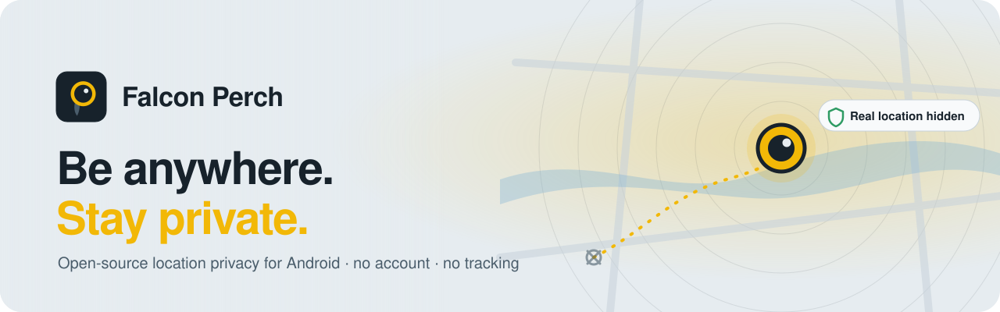
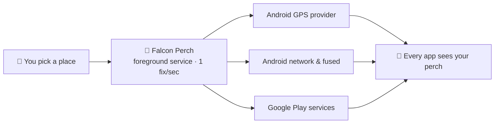

<a href="https://falcon-perch.github.io/">
  <picture>
    <source media="(prefers-color-scheme: dark)" srcset="./banner-dark.svg">
    <source media="(prefers-color-scheme: light)" srcset="./banner-light.svg">
    
  </picture>
</a>

<h3>Open-source tools that put you in charge of your location.</h3>

  <a href="https://falcon-perch.github.io/"><b>Website</b></a> ·
  <a href="https://github.com/Falcon-Perch/Falcon-Perch.github.io/releases/download/android-latest/falcon-perch.apk"><b>Download for Android</b></a> ·
  <a href="https://falcon-perch.github.io/app/"><b>Web app</b></a> ·
  <a href="https://github.com/Falcon-Perch/Falcon-Perch.github.io"><b>Source</b></a>

  
  
  

---

## 🦅 What we build

**Falcon Perch** lets you choose where your phone says you are.

Pick any place on the map, flip one switch, and every app on your Android phone sees that place instead of your real location. That includes Google Maps, weather, social and shopping apps. It's free, open source, and collects nothing: no account, no analytics, no servers.

<table>
  <tr>
    <td width="33%" valign="top">
      <h4>🌍 Every app, not just one</h4>
      Replaces Android's GPS, network and fused providers <i>and</i> Google Play services location, so Wi‑Fi and cell towers can't give you away.
    </td>
    <td width="33%" valign="top">
      <h4>🔒 Nothing leaves your phone</h4>
      No sign-up, no trackers, no ads, no backend. Your perch and saved places live only on your device, and one tap wipes them.
    </td>
    <td width="33%" valign="top">
      <h4>🧭 Travel, don't teleport</h4>
      Jump instantly, or walk, cycle or drive to a new perch along a real great-circle route.
    </td>
  </tr>
  <tr>
    <td width="33%" valign="top">
      <h4>🛑 Always in control</h4>
      A quiet notification shows while it's on, with a <b>Stop</b> button. If Android revokes access, the app tells you. It never fails silently.
    </td>
    <td width="33%" valign="top">
      <h4>📋 Privacy log</h4>
      See every location request and what answered it. Real coordinates are never written down.
    </td>
    <td width="33%" valign="top">
      <h4>🧩 No root required</h4>
      Uses Android's built-in <i>mock location app</i> setting. Works on Android 6.0 and newer.
    </td>
  </tr>
</table>

## ⚙️ How it works

Apps don't read the GPS chip directly. They ask Android or Google Play services. Falcon Perch answers both, once a second, with the place you chose.

## 🚀 Get started in two minutes

| Step | What to do |
| :---: | --- |
| **1** | [Download `falcon-perch.apk`](https://github.com/Falcon-Perch/Falcon-Perch.github.io/releases/download/android-latest/falcon-perch.apk) on your phone and install it. |
| **2** | Settings → About phone → tap **Build number** seven times to unlock Developer options. |
| **3** | Developer options → **Select mock location app** → **Falcon Perch**. |
| **4** | Allow location access, choose your perch and turn on **Apply my perch to all apps**. |

The app checks each step for you. On iPhone or desktop, the [web app](https://falcon-perch.github.io/app/) lets you choose the location used inside Falcon Perch itself. Apple doesn't let any app change the location other apps see.

## 📦 Repositories

| Repository | What's inside | Stack |
| --- | --- | --- |
| [**Falcon-Perch.github.io**](https://github.com/Falcon-Perch/Falcon-Perch.github.io) | The Android app, the web app and the [website](https://falcon-perch.github.io/), all in one place. | React · TypeScript · Capacitor · Java · Vite |

## 🧭 Our principles

- **Private by default.** If we don't collect it, it can't leak. We collect nothing.
- **Honest about limits.** We say plainly what we can't hide, so you can make informed choices.
- **Open by design.** Every line is public and every release is built in the open by GitHub Actions.
- **Small and auditable.** Few dependencies, no hidden services, code you can read in an afternoon.

<b>What Falcon Perch can't hide</b>

 

- **Your IP address.** Websites can estimate your city from your connection. Use a trusted VPN.
- **Your mobile carrier.** The network always knows which towers your phone uses.
- **Your Google account history.** Pause Timeline and turn off Wi‑Fi and Bluetooth scanning.
- **Detection.** Android marks replaced locations, so some banking apps and games may refuse to run.
- **Emergencies.** Tap **Stop** in the notification before calling emergency services, so responders can find you.

## 🤝 Get involved

- 🐞 **Found a bug or have an idea?** [Open an issue](https://github.com/Falcon-Perch/Falcon-Perch.github.io/issues/new).
- 🛠️ **Want to contribute?** Fork the repo, read the [README](https://github.com/Falcon-Perch/Falcon-Perch.github.io#readme), and open a pull request.
- 🔐 **Security issue?** Please report it privately through a [security advisory](https://github.com/Falcon-Perch/Falcon-Perch.github.io/security/advisories/new) rather than a public issue.
- ⭐ **Like the project?** Star the repo so more people can find it.

> [!NOTE]
> Falcon Perch is built to protect your privacy. Changing the location your own phone reports is a standard Android developer feature. Please don't use it to deceive or defraud anyone, and follow the laws where you live.

---

  Made with care for people who'd rather keep their whereabouts to themselves. 
  <a href="https://falcon-perch.github.io/">falcon-perch.github.io</a> · MIT licensed · Map data © OpenStreetMap contributors

